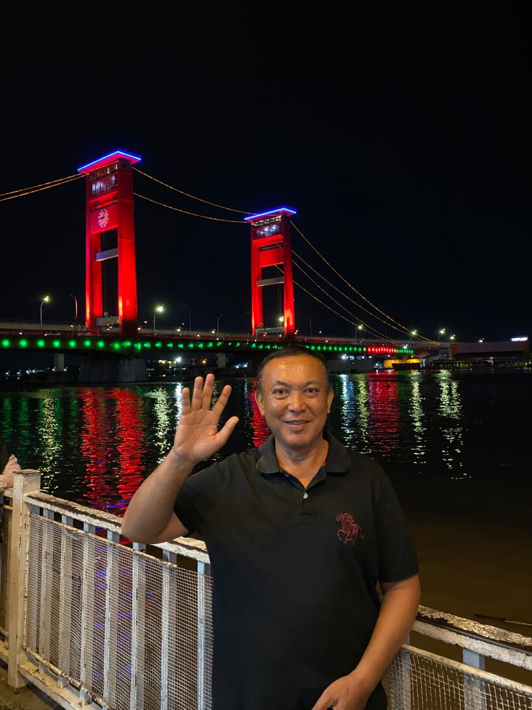
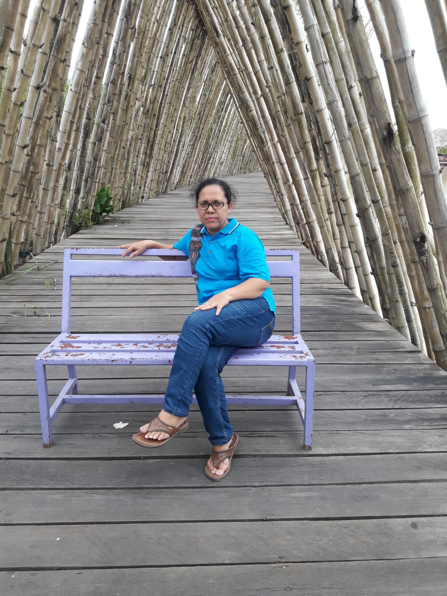
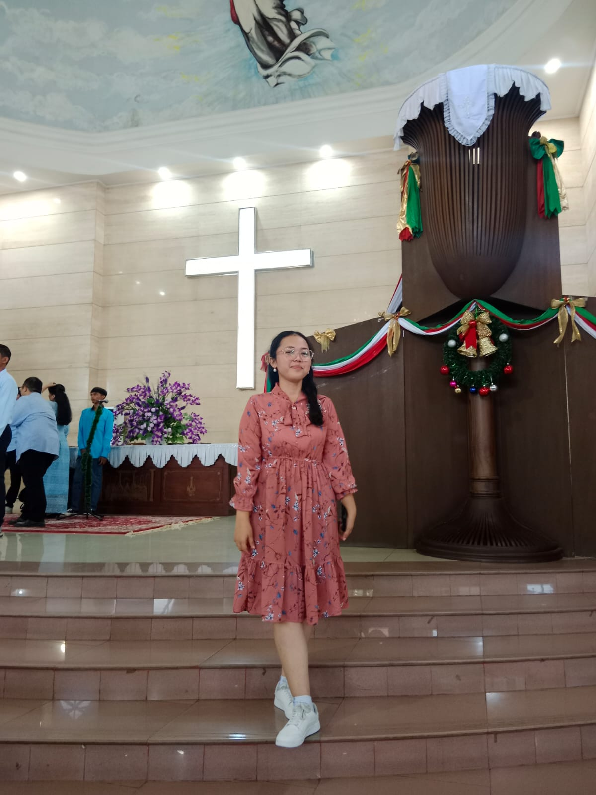

<html lang="id">
<head>
  <meta charset="UTF-8">
  <meta name="viewport" content="width=device-width, initial-scale=1.0">
  <title>HMKN FAMS - Nostalgia Keluarga</title>
  
</head>
<body>
  <canvas id="particles"></canvas>
  <nav>
    
HMKN FAMS

    

      <a href="#anggota">Anggota</a>
      <a href="#slideshow">Kenangan</a>
      <a href="#album">Album</a>
      <a href="#music">Musik</a>
    

  </nav>

  <header>
    

      <h1>HMKN FAMS</h1>
      <h2>Harta yang paling berharga adalah keluarga</h2>
      
↓ Scroll untuk melihat kenangan ↓

    

  </header>

<!-- END PART 1 -->
  <!-- =========================
       PART 2 — ALBUM KELUARGA
       ========================= -->
  <section id="anggota" class="fade-up">
    <h3>
Anggota Keluarga
</h3>
    

      

        
        

          <h4>Ayah</h4>
          
Penyemangat keluarga, tempat bersandar dan panutan sejati.

        

      

      

        
        

          <h4>Mama</h4>
          
Pelukannya adalah rumah, senyumnya penenang hati.

        

      

      

        
        

          <h4>Kakak</h4>
          
Pembawa canda, teman cerita, dan partner gila dalam petualangan.

        

      

      

        
        

          <h4>Aku</h4>
          
Pewaris tawa dan kenangan yang akan terus dijaga.

        

      

    

  </section>

  <!-- =========================
       SLIDESHOW KENANGAN
       ========================= -->
  <section id="slideshow" class="fade-up">
    <h3>Kenangan Bersama</h3>
    

      

        
        
        
        
      

    

  </section>

  <section id="album" class="fade-up">
    <h3>Album Keluarga</h3>
    

      

        
        

          <h4>Inagurasi</h4>
        

      

      

        
        

          <h4>Bersama Tulang</h4>
        

      

      

        
        

          <h4>Waktu kecil</h4>
        

      

      

        
        

          <h4>H-1 di IT Del</h4>
        

      

    

    

      

        
        

          <h4>sebelum PCA</h4>
        

      

      

        
        

          <h4>di patung sibea bea</h4>
        

      

      

        
        

          <h4>with mama</h4>
        

      

      

        
        

          <h4>with kakak</h4>
        

      

    

  </section>

  

  <!-- =========================
       VIDEO & MUSIK FAVORIT
       ========================= -->
  <section id="music" class="fade-up">
    <h3>Musik & Video Favorit Keluarga</h3>
    

      

        <iframe width="560" height="315" 
          src="https://www.youtube.com/embed/1ZYbU82GVz4?autoplay=0&mute=0" 
          title="Orkestra Nostalgia"
          frameborder="0"
          allow="accelerometer; autoplay; clipboard-write; encrypted-media; gyroscope; picture-in-picture"
          allowfullscreen></iframe>

        <iframe width="560" height="315" 
          src="https://www.youtube.com/embed/SVsEdZseq3o?si=n-fEP0StzgfAjhSN=0&mute=0" 
          title="Lagu Populer Bertema Keluarga"
          frameborder="0"
          allow="accelerometer; autoplay; clipboard-write; encrypted-media; gyroscope; picture-in-picture"
          allowfullscreen></iframe>
      

      

        <audio id="audioPlayer" controls autoplay loop>
          <source src="music1.mp3" type="audio/mp3">
          <source src="music2.mp3" type="audio/mp3">
          Browser kamu tidak mendukung audio.
        </audio>

        
🎵 Sedang memutar: Orkestra Keluarga

      

    

  </section>

  

<!-- END PART 2 -->
  <!-- =========================
       PART 3 — JAVASCRIPT INTERAKTIF
       ========================= -->
  

  <footer style="text-align:center; padding:50px; background:#fff8ee; color:#5a4734; font-size:0.9rem;">
    
© 2025 HMKN FAMS — Kenangan yang tak tergantikan 💛

  </footer>

</body>
</html>
